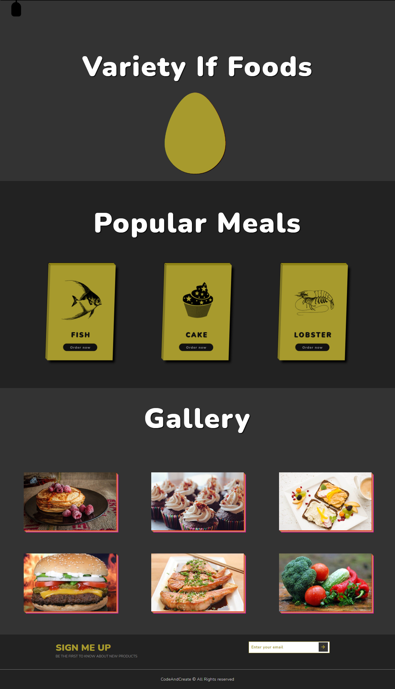

# Variety of food

## HTML

## CSS

### convert defult to 1 rem

```css
html {
  font-size: 62.5%; // จะมีค่าเริ่มต้นที่ 10px
}
```

### Media query size

```css
  0-480px for generally phone
  480-768px for Tablet and ipad
  769-1024px for generally notebook
  1025-1200px for generally desktop
```

### Other

- text transform capitalize เป็นการเปลี่ยนตัวอักษรตัวแรกให้เป็นตัวใหญ่
- Flexbox
  - display: flex;
  - flex-wrap: wrap;
  - align-items: center;
  - justify-content: space-evenly;
  -

## Picture of web design


